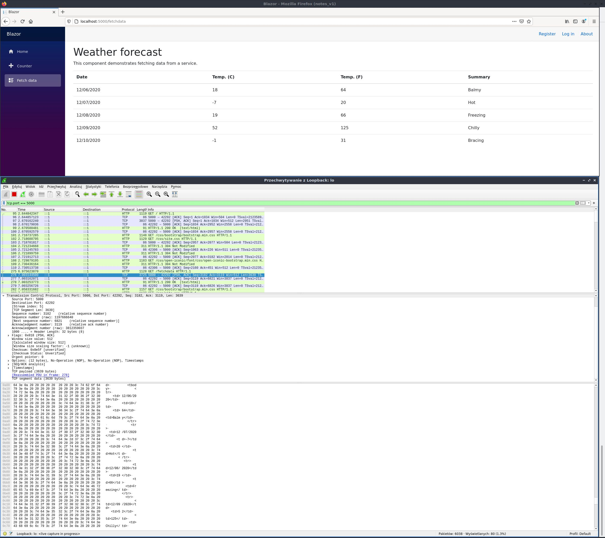
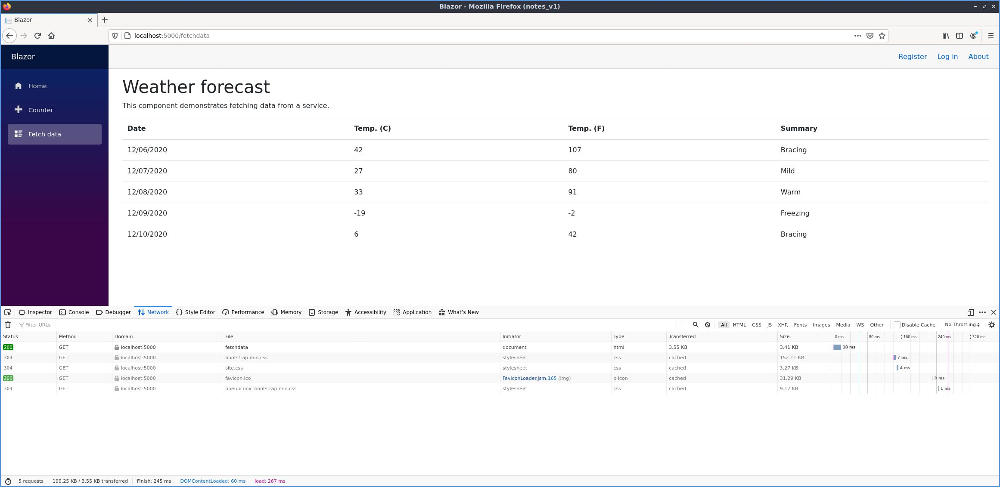
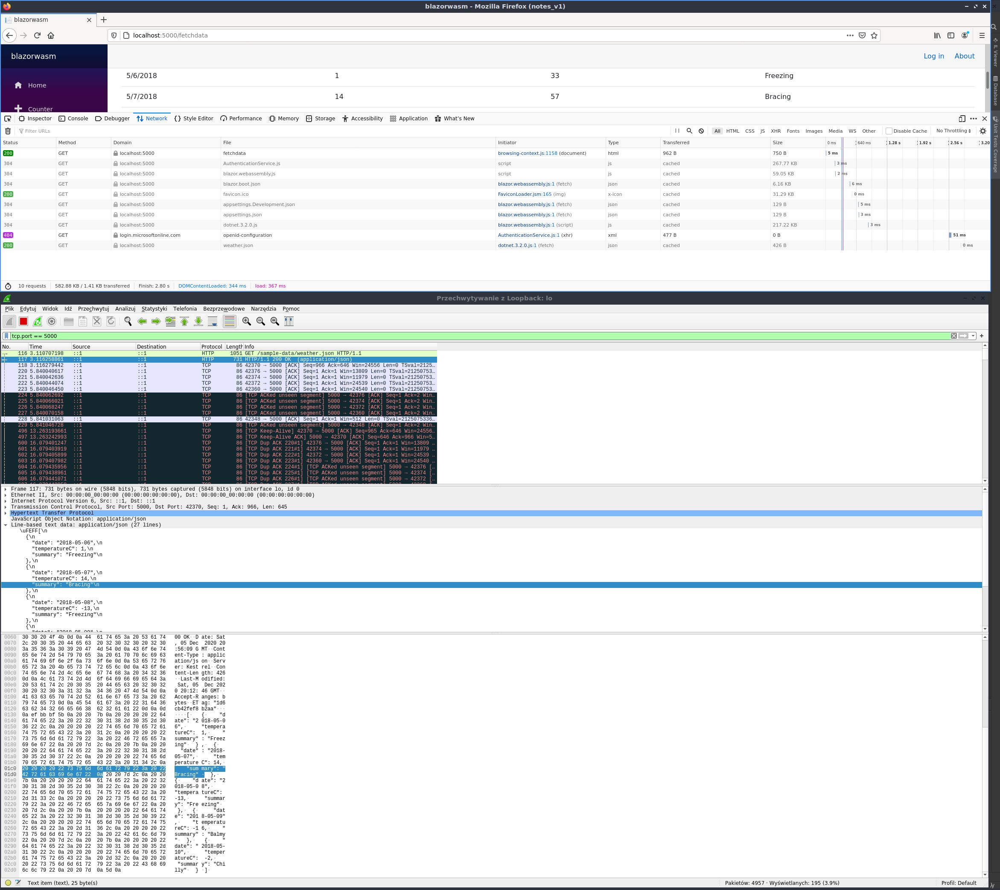

**Server**

W aplikacji BlazorServer strona tworzona jest po stronie serwera, a zmiany na stronie wysyłane są w pakietach zawieracjących zmiany w html'u, co można zobaczyć na przykładzie:
W aplikacjach tego typu występują opóźnienia wynikające z komunikacji pomiędzy klientem, a serwerem - z tego też powodu aplikacja ta nie nadaje się, gdy wymagana jest duża responsywność strony.
Za komunikację pomiędzy przeglądarką, a serwerem odpowiada blazor.server.js, który ustala połączenie SignalR z serwerem. Główne zalety tego rodzaju aplikacji to krótki czas ładowania strony (potrzeba pobrać mniej plików niż w przypadku WASM), możliwość korzystania z dużych zasobów serwera w porównaniu do zasobów klienta oraz brak ograniczeń jeśli chodzi o używane w aplikacji API.

**WASM**

W aplikacji BlazorWASM strona działa w całości po stronie klienta, dzięki zmiany w przeglądarce mogą zachodzić szybciej, bo nie ma opóźnienia wynikającego z komunikacji z serwerem, jednak wadą
tego rozwiązania jest dłuższy czas ładowania strony. W tym wariancie zmiany przesyłane są w formacie plikach json (a nie jak w blazor server plikach html), a w przeglądarka korzysta z możliwości .neta co widoczne jest na załączonym zrzucie z narzędzi deweloperskich przeglądarki.

[pełny opis różnic obu modeli](https://docs.microsoft.com/en-us/aspnet/core/blazor/hosting-models?view=aspnetcore-5.0 "pełny opis różnic obu modeli")